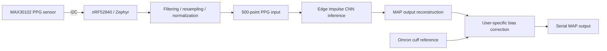

# On-Device PPG Blood Pressure Estimation

### nRF52840 · MAX30102 · Zephyr · Edge Impulse · TinyML

A capstone research prototype that acquires PPG over I²C, processes the signal on an nRF52840 MCU, and estimates **mean arterial pressure (MAP)** with a 1D CNN. The final project integrated sensor acquisition, embedded inference, and cuff-reference offset calibration.
**POSTECH capstone team project · September 2025–June 2026**

**My role:** I implemented the end-to-end sensing and inference pipeline, from PPG acquisition and preprocessing to model deployment on the nRF52840 and subject-specific calibration. I trained a 1D CNN using the public UCI PPG/ABP dataset and worked on quantization and input-size optimization for the MCU’s limited memory and computational resources.

## System

## Implementation highlights

- Integrated an Edge Impulse exported Zephyr module using nRF Connect SDK and flashed the nRF52840 board.
- Verified fixed-input inference with board logs, then integrated live MAX30102 IR samples.
- Reduced training input from 1,000 to 500 points while retaining the original 8-second window through resampling: 50% less input storage.
- Implemented I²C initialization, FIFO acquisition, buffered filtering, resampling, normalization, classifier callbacks, MAP reconstruction, and offset calibration.
- Investigated ADC saturation and adjusted LED current and ADC range to recover a varying PPG waveform.
- Compared board estimates with an Omron cuff reference and recorded an inference timing benchmark.

## Final-report results

### Cuff-reference comparison

| Metric | Before calibration | After calibration |
|---|---:|---:|
| MAE | 8.15 mmHg | 2.67 mmHg |
| RMSE | 8.88 mmHg | 3.04 mmHg |
| Signed bias | +8.15 mmHg | −2.67 mmHg |
| Mean relative error | 10.43% | 3.27% |

The report summarizes **three raw and three calibrated comparison rows**. Each row averages two cuff readings and five MCU predictions. Reported MAE reduction: approximately **67.3%**. Raw and calibrated readings were obtained in different sessions with different reference values; this is a small prototype experiment, not a controlled paired clinical validation or an independent population test.

Calibration subtracts a user-specific offset; it **does not retrain model weights**. These figures describe MAP, not separate systolic or diastolic prediction.

### Embedded benchmark

| Item | Reported value | Evidence type |
|---|---:|---|
| Model input | 500 points | Final implementation |
| Mean inference time | 9.563 seconds | 10 inference repetitions |
| Inference current | 4.5 mA | Assumed value |
| Supply voltage | 3.3 V | Assumed value |
| Power | 14.85 mW | Calculated from assumptions |
| Energy per inference | Approximately 142 mJ | Calculated using measured runtime |

Power and energy are **estimates**, not direct electrical measurements. Runtime requires optimization for faster wearable updates. The report does not establish verified peak RAM or Flash consumption.

### Earlier model evaluation

An initial Edge Impulse evaluation in the report lists MAE **5.06 mmHg**, MSE **40.90**, and explained variance **0.64**. These belong to a different evaluation stage and are not the final live-sensor accuracy.

## Repository and reproducibility

| Resource | Scope |
|---|---|
| [`src/`](src/) | Earlier Python preprocessing, PyTorch CNN training, ONNX export, model-to-header utilities |
| [`docs/intermediate-report.pdf`](docs/intermediate-report.pdf) | Earlier project report |
| This README | Final implementation and result summary from the supplied final report |

The final Edge Impulse model export, complete Zephyr build configuration, and raw experimental logs are not included in the original repository. The published earlier scripts alone do not reproduce the final hardware result. `src/convert_to_tflite.py` prepares sample calibration data; it is not a complete model converter.

The final report appendix contains differences requiring reconciliation before a reproducible rebuild: training preprocessing defaults to median/IQR scaling, while the embedded snippet uses z-score normalization; FIFO averaging must be checked against the effective acquisition rate before asserting an 8-second hardware window.

## Engineering lessons

Operator support, quantization, input normalization, and signal quality all affected deployment. Next steps include aligning training and firmware preprocessing, validating sample timing, publishing exact model/build artifacts, optimizing inference, and expanding subject-independent evaluation.

Research prototype for embedded implementation; no clinical certification or diagnostic performance claim.
