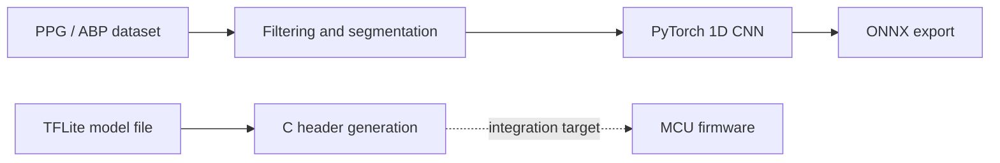

# PPG Blood Pressure Estimation / TinyML Preparation

### Signal processing · CNN modeling · Embedded model packaging

A research project exploring blood pressure estimation from photoplethysmography (PPG), with an emphasis on preparing models for resource-constrained devices. The published repository contains Python preprocessing, a PyTorch CNN, ONNX export, and model-to-C-header utilities.

**Stack:** Python · NumPy / SciPy · PyTorch · ONNX · TensorFlow Lite model data

[Project report](Middle_Report.pdf) · [Training code](code/train_onlycnn_beat.py) · [Model export](code/export_onnx.py) · [Code directory](code/)

## Workflow

The diagram separates the implemented ONNX export and C-header packaging steps. The checked-in `convert_to_tflite.py` generates sample calibration data; it does not perform ONNX-to-TFLite conversion.

## Explore the implementation

| File | What to inspect |
| :--- | :--- |
| [preprocessing.py](code/preprocessing.py) | PPG filtering, signal loading, and window preparation |
| [train_onlycnn_beat.py](code/train_onlycnn_beat.py) | 1D CNN, optional attention pooling, training, checkpoint saving |
| [export_onnx.py](code/export_onnx.py) | Model reconstruction and ONNX export |
| [convert_to_tflite.py](code/convert_to_tflite.py) | Sample calibration-array generation |
| [convert_to_header.py](code/convert_to_header.py) | Model bytes packaged as a C array |
| [waveform.py](code/waveform.py) | TFLite inference / waveform inspection utilities |
| [Middle_Report.pdf](Middle_Report.pdf) | Project context and intermediate report |

## Model development

The Python training implementation uses convolutional layers to extract features from PPG waveforms, with optional attention pooling. Related recurrent-model experiments are available in [MATLAB PPG](https://github.com/DooJinWon/Matlab_PPG).

The scripts use local dataset and model paths. Reproducing the workflow requires supplying the expected data and checkpoints, adjusting paths, and checking that preprocessing and exported-model inputs agree.

## Embedded direction

The deployment goal is low-power, on-device inference. C-array generation provides a bridge from a model file to embedded firmware. The public source does not include the target MCU firmware, trained model artifacts, or reproducible memory, latency, and power measurements. Those measurements are therefore not presented as verified results here.

## Next steps

- Publish reproducible dataset preparation and dependency versions.
- Use representative PPG samples for calibration and evaluate conversion accuracy.
- Include target firmware, model artifacts, and measured MCU resource usage.
- Document held-out evaluation and measured power consumption.

## Research scope

This repository presents experimental signal-processing and ML work. It does not establish clinical validation or suitability for diagnosis.
